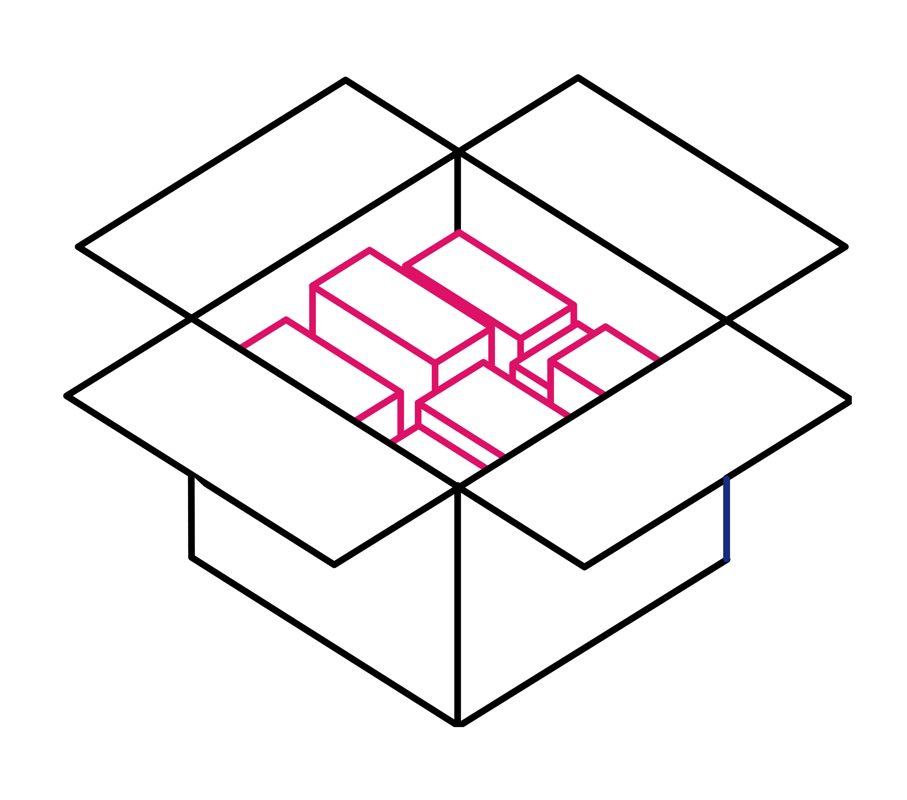
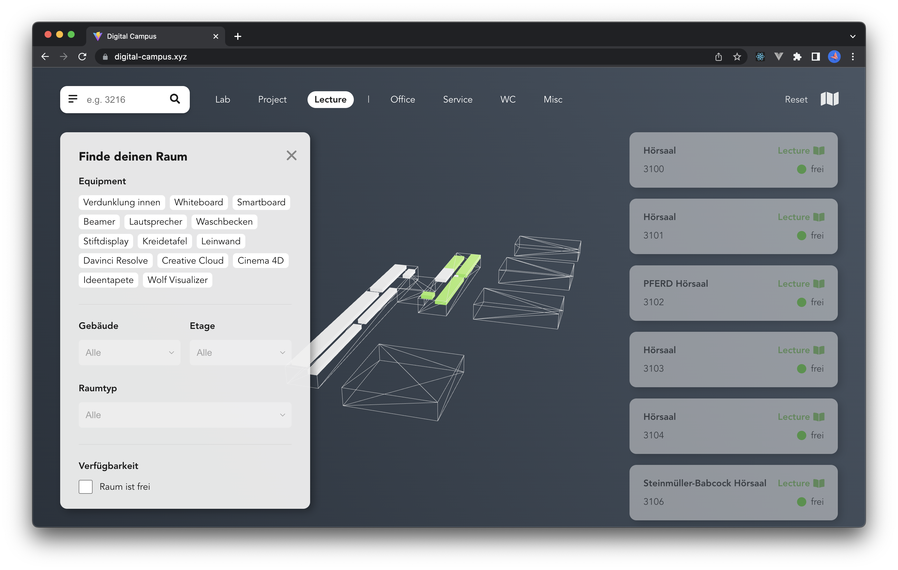
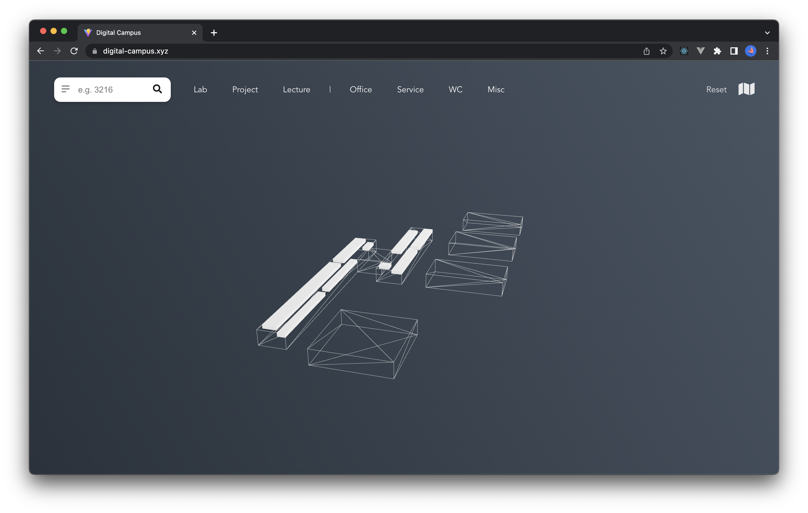
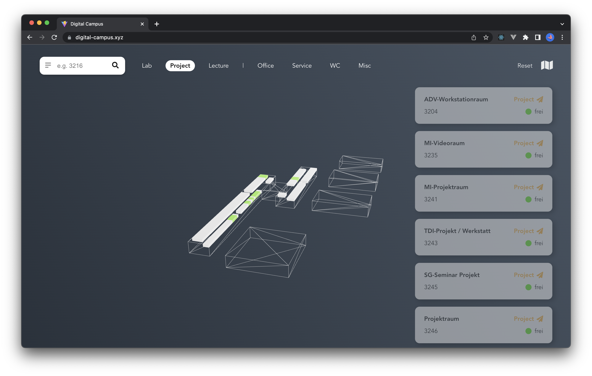
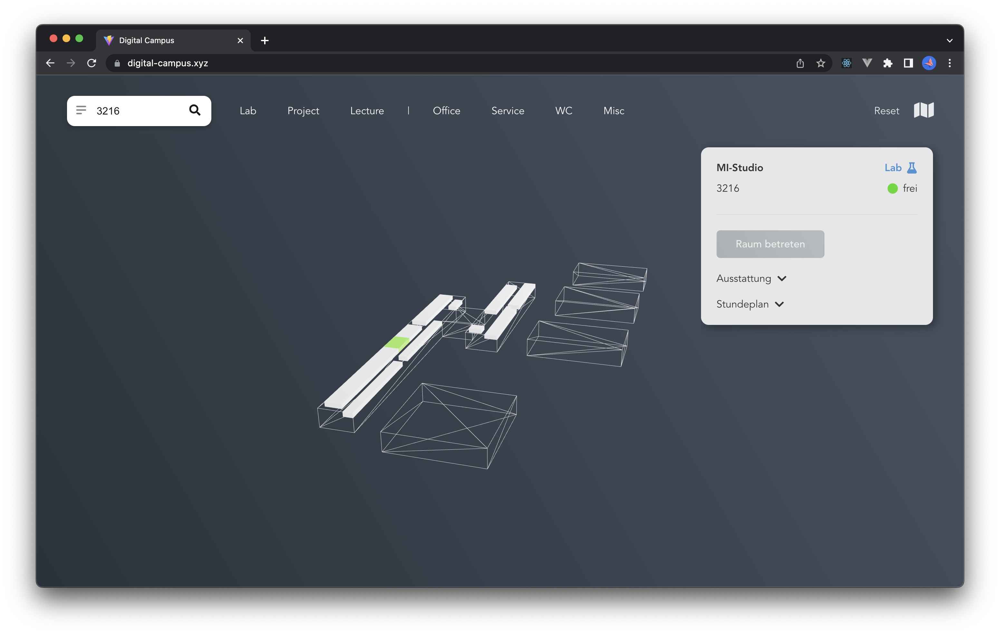
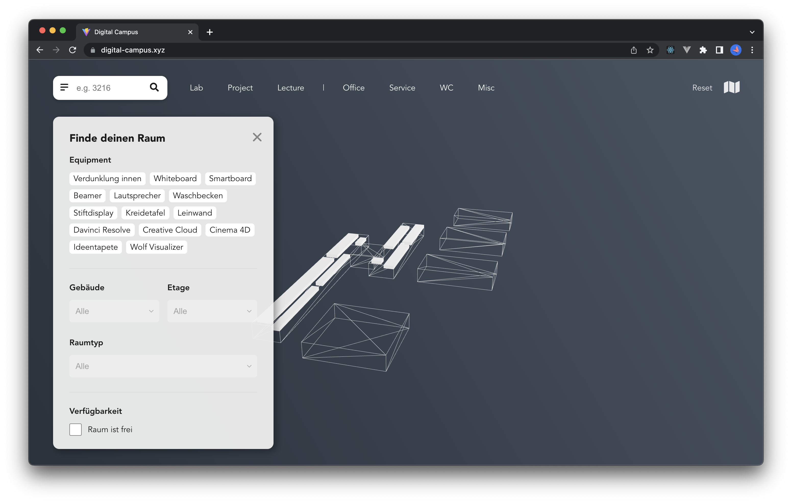
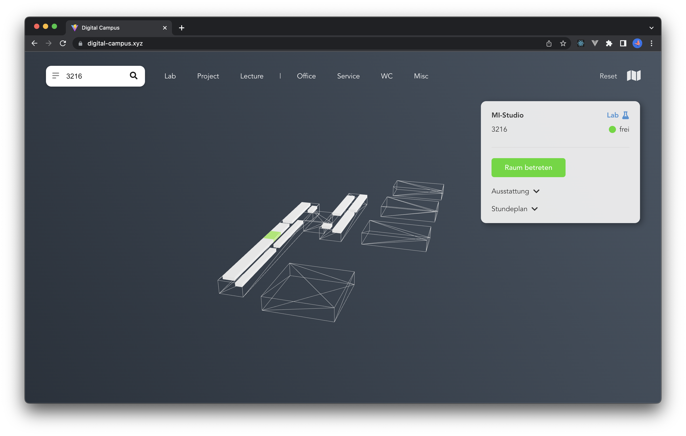
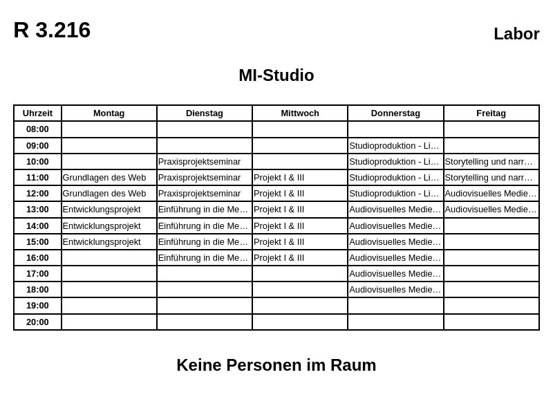

<a name="readme-top"></a>

<!-- PROJECT LOGO -->
<br />
<div align="center">
  <a href="https://github.com/antonztsv/EPWS2223HinzerRegneryZaitsev">
    
  </a>

<h3 align="center">Digital Campus</h3>

  <p align="center">
    Entwicklungsprojekt im Studiengang Medieninformatik an der TH Köln
    <br />
    <br />
    <p><strong>Calvin Hinzer</strong> - <a href="mailto:calvin_helmar.hinzer@smail.th-koeln.de">calvin_helmar.hinzer@smail.th-koeln.de </a></p>
    <p><strong>Florian Regnery</strong> - <a href="mailto:florian_maximilian.regnery@smail.th-koeln.de">florian_maximilian.regnery@smail.th-koeln.de</a></p>
    <p><strong>Anton Zaitsev</strong> - <a href="mailto:anton.zaitsev@smail.th-koeln.de">anton.zaitsev@smail.th-koeln.de</a></p>
  </p>
</div>

<!-- ABOUT THE PROJECT -->

## Über das Projekt



### Problemraum

Der Campus Gummersbach der Technischen Hochschule Köln verfügt als solche über mehrere Gebäude und Räume, welche nicht immer eindeutig gekennzeichnet sind. Gerade Studenten im ersten Semester haben oft keinen Überblick welche Funktion ein Raum hat, welches Material zu Verfügung steht oder ob ein Raum bereits belegt ist.

Es existieren zwar Angebote, um Studenten die Orientierung am Campus zu erleichtern, diese sind aber meistens unzureichend oder nicht ausreichend bekannt. Im [Hochschul-Planungs-System (HoPS)](https://fhpwww.gm.fh-koeln.de/hops/modules/roomequipment/room.php?room=0215) der TH Köln sind Informationen nur oberflächlich zu finden. In der [26-Seitigen Erstsemester Broschüre](https://www.th-koeln.de/mam/downloads/deutsch/hochschule/fakultaeten/informatik_und_ingenieurwissenschaften/erstsemesterbroschure_gesamt_august_2021.pdf) ist nur eine Seite dem Campus gewidmet, wo dieser nur grob kategorisiert ist.

### Zielsetzung

Das Ziel ist es, eine Abbildung des Campus in digitaler Form darzustellen. Hierbei soll es Benutzern möglich sein, nach Räumen und Equipment zu filtern. Zum Equipment gehören z. B. die benötigte Software, Hardware oder die verfügbaren Sitzplätze. Die Raumverfügbarkeit soll auf Basis aktueller Stundenpläne und Benutzereingaben ermittelt werden.

Zusätzlich zur Filterfunktion können sich Nutzer auch direkt Informationen und Metadaten zu individuellen Räumen anzeigen lassen.

### Leitthema - Multiscreen Web Applikation

#### Device Shifting

Bislang befinden sich kleine Tafeln mit der Raumnummer, der Bezeichnung sowie gegebenenfalls dem Stundenplan des Raumes neben der Tür.

Die Informationstafeln neben jedem Raum werden durch E-Ink Paper Displays ersetzt. Über sie werden begrenzt Rauminformationen präsentiert.

Mittels eines NFC-Tags am Display sollen Anwender auf die Hauptanwendung geleitet werden. Dort erhalten sie näheren Überblick zu dem jeweiligen Raum und erhalten die Möglichkeit, sich für den entsprechenden Raum einzutragen.

#### Synchronisation

Sollte sich ein Anwender für den Raum eintragen, so wird der Status in der Anwendung und dem E-Ink Paper Display aktualisiert und man erhält Einblick, ob ein Raum aktuell belegt ist oder nicht.

<p align="right">(<a href="#readme-top">Zum Anfang</a>)</p>

### Verwendete Technologien

<div>


</div>
<br>

Die einzelnen Microservices im Backend werden mit dem serverseitigem [Javascript Framework Node.js](https://nodejs.org/en/) umgesetzt. Dieses ermöglicht, vor allem durch die Einbindung von [externen NPM-Packages](https://www.npmjs.com/), eine schnelle und unkomplizierte Implementierung von Funktionalitäten. Die Kommunikaton zwischen den Services erfolgt durch die Anbindung des [Redis Message Brokers](https://redis.io/docs/manual/pubsub/), wodurch ein asynchroner Austausch von Nachrichten, auch im Falle eines Serviceausfalls, stattfinden kann.

Für die persistente Datenspeicherung wird eine MongoDB Datenbank in der Cloud über [MongoDB Atlas](https://www.mongodb.com/atlas/database) verwendet. Hierdurch kann eine gemeinsame und konsistente Datenbasis über die verschiedenen Stufen der Entwicklung hinaus garantiert und genutzt werden.

Die [Javascript Bibliothek React](https://reactjs.org/) wird im Frontend für eine schnelle komponentenbasierte Entwicklung zusammen mit der [3D Bibliothek Three.js](https://threejs.org/) eingesetzt, wodurch der Hochschulcampus in einer einfachen 3D-Ansicht ohne erhöhten Mehraufwand gerendert und für den Nutzer interaktiv dargestellt werden kann.

Der Austausch von Daten erfolgt zum einen über verschiedene REST-Schnittstellen, die von den jeweiligen Services bereitgestellt werden. Zum anderen wird eine Verbindung über die [Socket.io Bibliothek](https://socket.io/) zwischen dem Frontend und dem Backend aufgebaut, wodurch der Austausch von Echtzeitdaten über die Raumverfügbarkeit ermöglicht wird.

Damit die Services und das Frontend lokal entwickelt und getestet werden können, werden diese über [Docker sowie Docker Compose](https://www.docker.com/) verwaltet. Die Services können dadurch unabhängig zum darunterliegendem Entwicklungssystem gestartet werden und es treten keine Kompatibilitätsprobleme auf.

<p align="right">(<a href="#readme-top">Zum Anfang</a>)</p>

## Ausführung

Das Projekt kann lokal mit eingeschränktem Funktionsumfang über _docker compose_ gestartet und ausgeführt werden. Da die Anwendung Schreibzugriff auf eine externe Datenbank benötigt, wird im Repository standardmäßig nur ein Zugangsschlüssel mit Lesezugriff gespeichert.

Der volle Funktionsumfang der Anwendung kann in der deployten Version eingesehen werden. Mehr Informationen hierzu siehe Punkt [Verwendung](#verwendung).

### Voraussetzungen

Folgende Programme werden benötigt:

- Docker inkl. Docker Compose
  ```
  https://www.docker.com/get-started/
  ```

### Installation

1. Das Repository klonen
   ```
   git clone git@github.com:antonztsv/EPWS2223HinzerRegneryZaitsev.git
   ```
2. In den Ordner wechseln
   ```
   cd EPWS2223HinzerRegneryZaitsev
   ```
3. Alle erforderlichen _.env Dateien_ müssen erstellt, bzw. kopiert werden.

   Per Skript (führt lediglich die unteren Kopiervorgänge durch)

   ```
   ./config-env.sh
   ```

   oder manuell (kann direkt so kopiert und ins Terminal eingegeben werden):

   ```
   cp ./backend/auth_service/.env.example ./backend/auth_service/.env
   cp ./backend/data_service/.env.example ./backend/data_service/.env
   cp ./backend/display_service/.env.example ./backend/display_service/.env
   cp ./frontend/.env.example ./frontend/.env
   ```

4. Anwendungen über _docker compose_ starten

   ```
   docker compose up -d --build
   ```

   Anwendungen können über _docker compose_ auch wieder gestoppt werden

   ```
   docker compose down
   ```

5. Anwendung öffnen
   ```
   http://localhost:3000
   ```

<p align="right">(<a href="#readme-top">Zum Anfang</a>)</p>

## Verwendung

Die Anwendung kann unter [www.digital-campus.xyz](https://www.digital-campus.xyz) aufgerufen und verwendet werden.

> **ACHTUNG:**<br>
> Das Frontend sowie die jeweiligen Services werden nach 15 Minuten Inaktivität gestoppt und benötigen beim Aufruf ca. 30 Sekunden um wieder zu starten.<br>
> Die Seite sollte deshalb einmal geladen werden und anschließend nochmals nach ca. 30 Sekunden. Wenn die Abbildung des Campus zu sehen ist, kann auch davon ausgegangen werden, dass das System einsatzbereit ist (ansonsten bitte nochmals warten).

Wenn die Anwendung einsatzbereit ist, sollte folgende Ansicht zu sehen sein:



Im oberen Bereich der Anwendung kann in der Suchleiste nach einem spezifischen Raum gesucht werden. Zusätzlich kann über die Schnellsuchfunktion nach einem gewünschten Raumtypen gefiltert werden.



Einzelne Räume können durch einen Klick auf den Raum in dem Modell ausgewählt werden. Die Raumdetails werden dann im rechten Bereich der Anwendung angezeigt.

Ausgewählte Raume zeigen die Raumnummer, den Raumnamen, den Raumtypen, die aktuelle Verfügbarkeit, das vorhandene Equipment und den Stundenplan an.



Um nach einem verfügbaren Raum oder nach einem bestimmten Equipment zu suchen, kann über die Filtersuche auf der linken Seite der Anwendung nach den jeweiligen Kriterien gefiltert werden. Das Formular kann durch einen Klick auf das Filter-Symbol auf der linken Seite der Suchleiste geöffnet werden.

Dabei können die einzelnen Assets, die Gebäude- bzw. Raumdetails und die zeitlichen Kriterien festgelegt werden.

> Wichtig: Die Filterung nach Gebäude- bzw. Raumdetails ist nur möglich, wenn zuvor mindestens ein Asset oder die Verfügbarkeit ausgewählt wurde.



Um einen Raum betreten zu können, müsste man am Campus den NFC-Tag vor einem Raum scannen. Durch den Scan erhält man als Nutzer einen Token, der für die Anmeldung an einem Raum verwendet werden kann.

Um diese Funktionen zu testen, kann folgender Endpoint aufgerufen werden (Bsp. für Raum 3216):

```
https://auth-6ve0.onrender.com/link/3216
```

Über diesen erhält man einen Link, welcher kopiert und im Browser eingegeben werden kann.

```html
https://www.digital-campus.xyz/?token=1234567890
```

Nach dem Aufruf des Links wird der Nutzer auf die Anwendung weitergeleitet und kann den Raum betreten.



Die Nutzeranzahl eines Raumes wird dabei dynamisch für jeden Nutzer aktualisiert. Dies kann auch auf der E-Ink Anzeige eingesehen werden.

```
https://display-ue6q.onrender.com/timetable/campus/Gummersbach/rooms/3216
```

<div align="center">
  
</div>

Beim Verlassen des Raumes über die Anwendung (Klick auf den Button) wird der Token wieder gelöscht und die Nutzeranzahl wird dynamisch für alle anderen Nutzer aktualisiert.

<p align="right">(<a href="#readme-top">Zum Anfang</a>)</p>

## Endpoints

Folgende zur Verfügung stehende Endpoints können von den jeweiligen Services aufgerufen werden. Diese sind für die Anwendungslogik notwendig und werden nicht von einem Nutzer direkt aufgerufen.

### data_service:

**`GET` - Alle Campus Daten**

```
http://localhost:8000/api/campus
```

**`GET` - Ein Campus**

```
http://localhost:8000/api/campus/:name
```

**`GET` - Alle Räume eines Campus**

```
http://localhost:8000/api/campus/:name/:rooms
```

Zusätzliche optionale Query Parameter:

| Parameter | Beschreibung               | Beispiel                 |
| --------- | -------------------------- | ------------------------ |
| status    | Verfügbarkeit eines Raumes | true                     |
| day       | Wochentag                  | tuesday                  |
| time      | Uhrzeit                    | 12:00                    |
| asset     | ID eines Assets            | 63bda39f455c6a8f49d1b28a |
| building  | Gebäude                    | Gebäude B                |
| level     | Etage                      | 3                        |
| type      | Raumtyp                    | project                  |

Beispiel:

```
http://localhost:8000/api/campus/Gummersbach/rooms?status=true&day=tuesday&time=12:00&asset=63bda39f455c6a8f49d1b28a&building=Gebäude A&level=3&type=project
```

**`GET` - Assets**

```
http://localhost:8000/api/assets
```

**`GET` - Stundenpläne**

```
http://localhost:8000/api/timetables
```

### auth_service:

**`GET` - JWT Status Check**

```
http://localhost:8002/auth?token=
```

**`POST` - Login (Raum beitreten)**

```
http://localhost:8002/auth
```

Body

```json
{
  "tokenOld": "1234",
  "tokenNew": "1234"
}
```

**`DELETE` - Logout (Raum verlassen)**

```
http://localhost:8002/auth
```

Body

```json
{
  "token": "1234"
}
```

**`GET` - Nutzeranzahl eines Raumes**

```
http://localhost:8002/api/count?room=
```

**`GET` - Generierung eines JSON Web Tokens (JWT)**

```
http://localhost:8002/token/:room
```

**`GET` - Generierung eines Links für einen Raum**

```
http://localhost:8002/link/:room
```

### display_service:

**`GET` - E-Ink Display Seite für einen Raum**

```
http://localhost:8001/display/campus/:campus/rooms/:room
```

Zusätzliche optionale Query Parameter:

| Parameter | Beschreibung       | Beispiel |
| --------- | ------------------ | -------- |
| type      | Format der Antwort | html     |

Wenn nicht angegeben, wird die Antwort als Bild gesendet.

**`GET` - Stundenplan für einen Raum**

```
http://localhost:8001/timetable/campus/:campus/rooms/:room
```

Zusätzliche optionale Query Parameter:

| Parameter | Beschreibung       | Beispiel |
| --------- | ------------------ | -------- |
| type      | Format der Antwort | html     |

Wenn nicht angegeben, wird die Antwort als Bild gesendet.

<p align="right">(<a href="#readme-top">Zum Anfang</a>)</p>

<!-- CONTACT -->

## Kontakt

Calvin Hinzer - calvin_helmar.hinzer@smail.th-koeln.de

Florian Regnery - florian_maximilian.regnery@smail.th-koeln.de

Anton Zaitsev - anton.zaitsev@smail.th-koeln.de

<br>

Projekt Link: [https://github.com/antonztsv/EPWS2223HinzerRegneryZaitsev](https://github.com/antonztsv/EPWS2223HinzerRegneryZaitsev)

<p align="right">(<a href="#readme-top">Zum Anfang</a>)</p>
